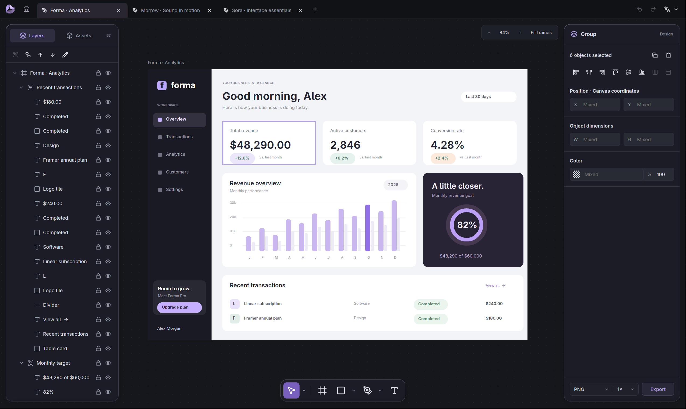
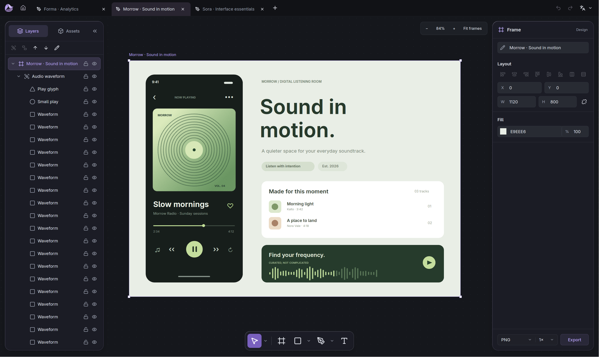
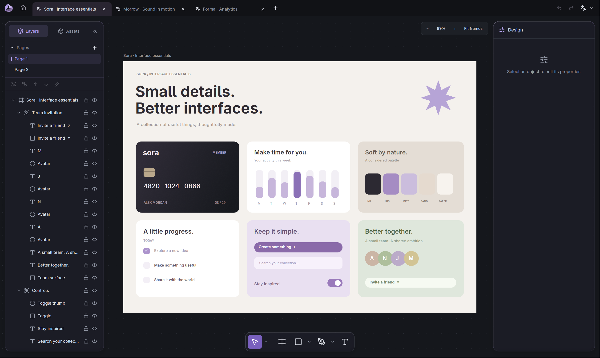

# Rovar

[English](README.md) | 简体中文

使用 Rust 和 GPUI 构建的桌面设计编辑器。支持画板、矢量、文字、图片、视频、组件复用、多页面文档和多文档标签页，设计自动保存到本地工作区。

支持 PNG、SVG、视频原文件和 `.rovar` 文档导出，提供英文和简体中文界面。

这个类 Figma 项目主要由 GPT-6 Astra 开发，目的是展示我的 GPUI 的能力。目前功能已比较完善，但我不一定会把它做成完整产品。如果想用的人多，或者以后我自己需要，可能会继续完善。







## 运行

```sh
cargo run --locked -p rovar
```

## 构建

Linux 下使用 Nushell：

```nu
nu scripts/build.nu
nu scripts/build.nu all
```

支持 AppImage、tar.gz、RPM、DEB 和 Arch，产物输出到 `dist/`。

macOS 下使用 Nushell 和 Xcode Command Line Tools：

```sh
nu scripts/build.nu macos
```

构建 release 版本，生成 `.app`、ZIP 和 DMG。
产物包含 `dist/Rovar.app`、带版本号的压缩包、SHA-256 校验文件和构建信息。
仅支持 Apple Silicon（arm64），也可使用 `--output` 和 `--keep-work`。

详见 [macOS 打包说明](packaging/macos/README.md)。

[文件格式](crates/rovar-format/FORMAT.zh-CN.md) · [MIT 许可证](LICENSE)
